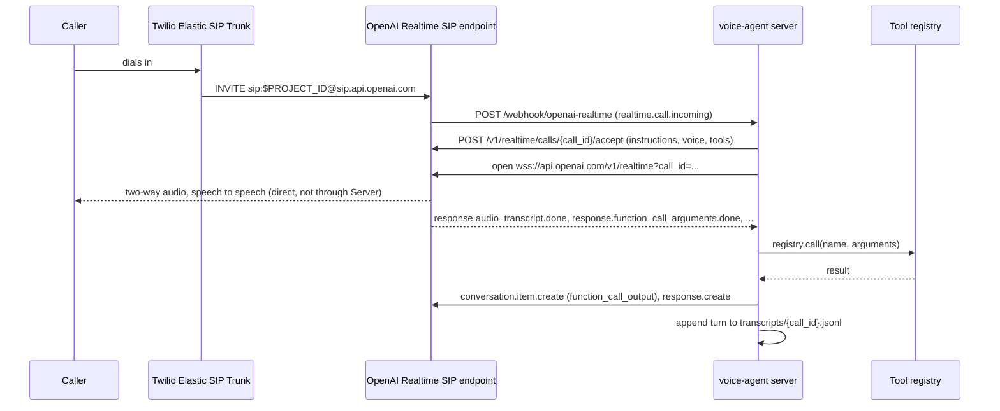

# voice-agent-starter

[](https://github.com/25andresbernal/voice-agent-starter/actions/workflows/ci.yml)

A working reference implementation of an inbound and outbound phone voice
agent: Twilio Elastic SIP Trunking routed directly into OpenAI's Realtime
API over SIP, with tool calling, JSONL call transcripts, and a call-quality
eval harness that scores those transcripts.

## Why this exists

Most voice-agent tutorials wire a phone call through a telephony provider's
WebSocket audio stream, into your own server, into a separate
speech-to-text model, into an LLM, into a separate text-to-speech model,
and back. That is four systems in the audio path before the call reaches
the model that is actually having the conversation, and each one adds
latency and a place for the call to go wrong.

This starter uses the other architecture: point the SIP trunk directly at
the model provider's own SIP endpoint, and keep your server out of the
audio path entirely. Your server's job becomes answering a webhook,
handing back a session configuration (instructions, voice, tools), and
watching a text-level event stream to run tool calls and write a
transcript.

This is a reference implementation built from scratch for a fictional
business, not a copy of any production system. The architecture is the
one I would choose today for a phone agent, and the design notes explain
why in terms of what went wrong with the alternatives. See
`docs/design-notes.md` for the full argument, including
the specific turn-taking failure modes (monologuing, premature closes, no
mirroring) this removes and why debugging a wrapper platform in front of a
model is hard.

## Demo

`voice-agent demo` runs a full simulated call through the real agent loop,
the real tool registry, and the real transcript writer, using a scripted
fake Realtime connection instead of a network socket. No API key, no
network access. Real captured output, trimmed for length:

```
$ uv run voice-agent demo
Simulated call complete. Transcript written to transcripts/demo-20260924T044813-d4ade9.jsonl

{"call_id": "demo-...", "turn": 1, "speaker": "assistant", "text": "Thanks for calling Riverside Wellness Studio. How can I help you today?", ...}
{"call_id": "demo-...", "turn": 2, "speaker": "user", "text": "Hi, I'd like to book a massage for this Friday.", ...}
{"call_id": "demo-...", "turn": 3, "speaker": "tool", "text": "", "tool_call": {"name": "look_up_availability", "arguments": {"service": "massage", "date": "2026-09-25"}, "result": {"available_times": ["09:00", "11:00", "13:00"]}}, ...}
{"call_id": "demo-...", "turn": 4, "speaker": "assistant", "text": "I have openings Friday at nine a.m., eleven a.m., and one p.m. Which time works best for you?", "latency_ms": 550, ...}
{"call_id": "demo-...", "turn": 5, "speaker": "user", "text": "One p.m. works great. My name is Jordan.", ...}
{"call_id": "demo-...", "turn": 6, "speaker": "tool", "text": "", "tool_call": {"name": "book_appointment", "arguments": {"service": "massage", "date": "2026-09-25", "time": "13:00", "customer_name": "Jordan"}, "result": {"status": "confirmed", "booking_id": "bk_1ed1dcb6b7"}}, ...}
{"call_id": "demo-...", "turn": 7, "speaker": "assistant", "text": "You're all set for one p.m. on Friday, Jordan. You'll get a text confirmation shortly. Is there anything else I can help with?", "latency_ms": 500, ...}
{"call_id": "demo-...", "turn": 8, "speaker": "user", "text": "No, that's everything. Thank you!", ...}
{"call_id": "demo-...", "turn": 9, "speaker": "assistant", "text": "You're welcome. Thanks for calling Riverside Wellness Studio, have a great day.", "latency_ms": 300, ...}

Call quality scorecard: transcripts/demo-20260924T044813-d4ade9.jsonl
------------------------------------------------------------------------------
Assistant turn length   100.0  avg 16.2 words/turn (target <= 40), max 23
One question per turn   100.0  0 of 4 turns asked more than one question
No premature close      100.0  no closing language before the caller was done
Tool-call correctness   100.0  2/2 tool calls succeeded
Response latency        100.0  avg 450 ms (target <= 1500 ms), max 550 ms
------------------------------------------------------------------------------
Overall score: 100.0/100 (A)
```

Note the assistant's spoken slot list (turn 4: "nine a.m., eleven a.m., and one p.m.") is generated from the actual `look_up_availability` tool result (turn 3), and the booked time (turn 6: `"time": "13:00"`) is the same slot the assistant just offered and the caller picked ("one p.m."). The script composes its lines from real tool output rather than hand-typed text, so they cannot drift apart. See `src/voice_agent/fake_realtime_client.py`.

Five more example transcripts, each engineered to fail exactly one
scorecard metric, are in `examples/transcripts/`; run `voice-agent eval` on
any of them to see the harness catch it (see Configuration below).

## Architecture



The important detail: call audio flows directly between Twilio and OpenAI.
The server only ever sees text-level events over the WebSocket. Outbound
calling (`voice-agent call`) is a thin wrapper around the same endpoint: it
asks Twilio to place a call and immediately bridge it into the same SIP
URI, so the call arrives at the webhook exactly like an inbound one and is
handled by the same code path.

## Quick start

Runs in under five minutes with no accounts and no API keys:

```bash
git clone https://github.com/25andresbernal/voice-agent-starter.git
cd voice-agent-starter
uv venv --python 3.12
uv pip install -e ".[dev]"
uv run voice-agent demo
```

Run the tests and linter the same way:

```bash
uv run pytest
uv run ruff check .
```

Score any transcript, including the sample failures in `examples/transcripts/`:

```bash
uv run voice-agent eval examples/transcripts/example-premature-close.jsonl
```

### Real mode (needs API keys and a public URL)

1. Copy `.env.example` to `.env` and fill in `OPENAI_API_KEY` and
   `OPENAI_PROJECT_ID` at minimum.
2. Point your Twilio Elastic SIP Trunk's origination URI at
   `sip:<OPENAI_PROJECT_ID>@sip.api.openai.com;transport=tls`.
3. Expose this server publicly, for example with `ngrok http 8000`, and
   configure the resulting URL plus `/webhook/openai-realtime` as the
   webhook endpoint on platform.openai.com.
4. `uv run voice-agent serve`

## Configuration

Every variable is documented in `.env.example`.

| Variable | Required for | Purpose |
|---|---|---|
| `OPENAI_API_KEY` | `serve`, `call` | Secret key used to accept calls and open the events WebSocket. |
| `OPENAI_PROJECT_ID` | `serve`, `call` | Also the SIP username: `sip:<id>@sip.api.openai.com`. |
| `OPENAI_WEBHOOK_SECRET` | `serve` (recommended) | Verifies incoming webhook events are genuinely from OpenAI. |
| `REALTIME_MODEL` | `serve`, `call` | Model used to accept calls. Default `gpt-realtime`. |
| `REALTIME_VOICE` | `serve`, `call` | Voice for the session. Default `alloy`. |
| `TWILIO_ACCOUNT_SID` | `call` | Twilio account placing outbound calls. |
| `TWILIO_AUTH_TOKEN` | `call` | Twilio auth token. |
| `TWILIO_FROM_NUMBER` | `call` | Caller ID for outbound calls. |
| `PORT` | `serve` | Webhook server port. Default `8000`. |
| `PUBLIC_BASE_URL` | `serve` (documentation only) | Recorded in server startup logs; not required for the server to run. |

`demo` and `eval` need none of the above.

## How it works

- **`src/voice_agent/agent_loop.py`** is the one piece of code both `demo`
  and `serve` run. It only knows about Realtime API event names
  (`response.function_call_arguments.done`, `response.audio_transcript.done`,
  and so on) through a small `RealtimeConnection` protocol, never about
  Twilio, SIP, or WebSockets directly.
- **`src/voice_agent/realtime_client.py`** implements that protocol for
  real: it accepts calls via `POST /v1/realtime/calls/{call_id}/accept`
  and streams events over `wss://api.openai.com/v1/realtime?call_id=...`.
- **`src/voice_agent/fake_realtime_client.py`** implements the same
  protocol with a scripted conversation and a fabricated clock, so
  `voice-agent demo` exercises the exact same agent loop and tool registry
  with zero network access.
- **`src/voice_agent/tools/`** is a small registry of JSON-schema-backed
  tools (`look_up_availability`, `book_appointment`, `transfer_to_human`)
  used both to build the session's tool definitions and to dispatch
  `function_call` events.
- **`src/voice_agent/transcript.py`** appends one JSON line per turn
  (speaker, text, timestamp, tool call, latency) to `transcripts/{call_id}.jsonl`.
- **`evals/scorecard.py`** scores a transcript on five heuristics: turn
  length, one question per turn, no premature close, tool-call
  correctness, and response latency. **`evals/judge.py`** adds an optional
  LLM-graded rubric score, off by default (`--llm-judge`), backed by a
  deterministic `FakeJudge` in tests and as the automatic fallback when no
  API key is configured.

## Design decisions

- **Direct SIP over a Media Streams / wrapper-platform architecture.**
  Tradeoff: less control over raw audio (no custom VAD, no in-process
  transcoding) in exchange for two fewer network hops in the latency
  budget and a server that cannot itself introduce audio bugs, because it
  never touches audio. Right call when the model provider offers a SIP
  endpoint and you don't need to touch raw audio; see `docs/design-notes.md`.
- **One agent loop, two connections.** `AgentLoop` depends on a
  `RealtimeConnection` protocol, not a WebSocket. Tradeoff: an extra layer
  of indirection in exchange for an offline demo that runs the actual
  production code path, not a separate mock of it, which is what makes
  "if it doesn't run, it isn't done" checkable in under five minutes.
- **Five deterministic scorecard metrics before one optional LLM judge.**
  Tradeoff: the heuristics are blunter than an LLM's judgment, but a PM can
  read `evals/scorecard.py` top to bottom and know exactly what each score
  means and why it moved, which an LLM-judge score alone does not offer.
  The LLM judge is additive, not load-bearing, and off by default.
- **Outbound is a thin wrapper, not a parallel system.** An outbound call
  is just a Twilio call that immediately bridges into the same SIP URI, so
  it lands on the same webhook and the same agent loop as an inbound call.
  Tradeoff: less control over outbound-specific logic (retry policy,
  answering-machine detection) in exchange for zero duplicated call-handling
  code.
- **Fake tool backends instead of a real scheduling API.** Tradeoff: the
  three example tools return deterministic, hash-based fake data instead
  of hitting a real calendar, so the whole repository runs with no
  external accounts. Swapping in a real backend only means changing the
  three `handler` functions in `src/voice_agent/tools/`; the schemas, the
  registry, and the agent loop do not change.

## Cost model

Twilio Elastic SIP Trunking pricing, from
https://www.twilio.com/en-us/sip-trunking/pricing, fetched 2026-09-23:

| Item | Rate |
|---|---|
| US termination (Zone 1, the 48 states) | $0.0100 / min |
| US local-number origination | $0.0034 / min |
| Local phone number | $1.15 / month |
| Call recording (if enabled) | $0.0025 / min |

OpenAI Realtime API (`gpt-realtime`) pricing, from
https://platform.openai.com/docs/pricing, fetched 2026-09-23:

| Item | Rate |
|---|---|
| Audio input | $32.00 / 1M tokens |
| Audio output | $64.00 / 1M tokens |
| Cached audio input | $0.40 / 1M tokens |

OpenAI bills Realtime audio per token, not per minute, but the audio
token rate is itself documented: the "Per-Response costs" section of
https://platform.openai.com/docs/guides/realtime-costs, fetched
2026-09-23, states that "audio tokens in user messages are 1 token per
100 ms of audio" and "audio tokens in assistant messages are 1 token per
50 ms of audio." That is 10 input tokens/sec (600/min) and 20 output
tokens/sec (1,200/min), and gives an exact per-minute cost:

```
input:  600 tokens/min x $32  / 1,000,000 = $0.0192 / min of caller audio
output: 1,200 tokens/min x $64 / 1,000,000 = $0.0768 / min of assistant audio
```

Approximate all-in cost per call minute, assuming continuous audio on both
legs (a minute where the caller is talking and a minute where the
assistant is talking, which is the common worst-case way to budget a
back-and-forth call):

| Component | Per minute | Basis |
|---|---|---|
| Twilio (trunk termination + local number amortized) | ~$0.01 | Twilio SIP Trunking pricing page, fetched 2026-09-23 |
| OpenAI Realtime audio (input + output) | ~$0.096 ($0.0192 + $0.0768) | OpenAI Realtime costs guide's documented token-per-ms rate x OpenAI pricing page's per-token rate, both fetched 2026-09-23 |
| **Total** | **~$0.11 / min** | sum of the above |

This does not include cached-input discounts (silence and repeated audio
context can be billed at $0.40/1M tokens instead of $32/1M once caching
applies), tool-call token cost, or Twilio's toll-free/high-cost-zone
rates; treat ~$0.11/min as a starting budget number, not an invoice.

## Roadmap

- Barge-in and interruption handling notes once observed on real calls.
- A second outbound flow: proactive callback after a missed inbound call.
- Optional Twilio recording plus a script to attach the recording URL to
  the JSONL transcript for side-by-side review.
- Expand the LLM-judge rubric to a multi-dimension score (resolution,
  tone, policy adherence) instead of one overall number.

## Contributing

Issues and pull requests are welcome. Run `uv run pytest` and
`uv run ruff check .` before opening a PR; CI runs both plus the offline
demo on every push and pull request.

## License

MIT. See `LICENSE`.
